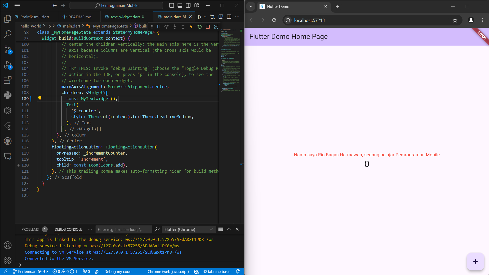
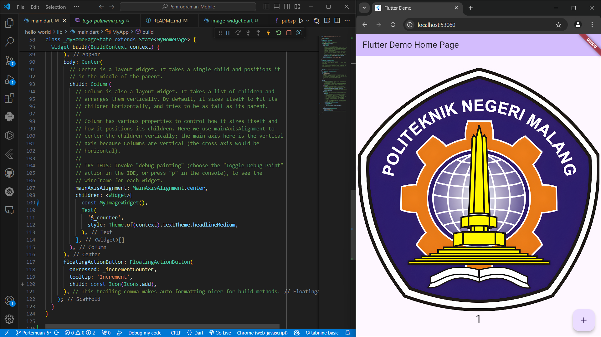
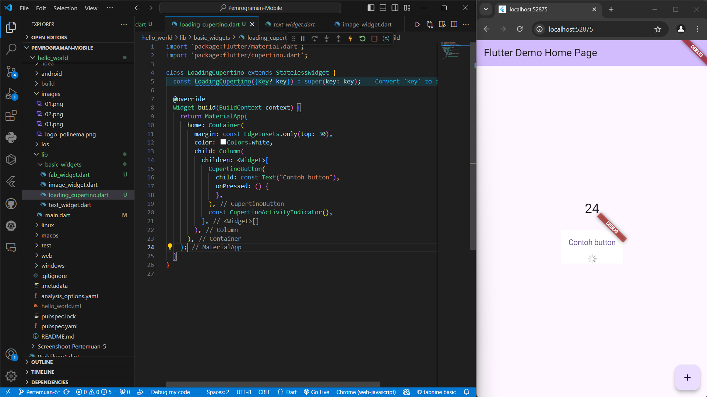
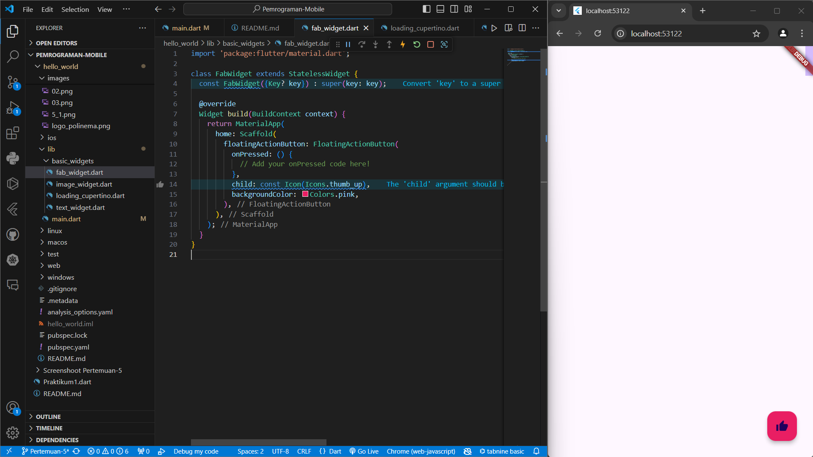
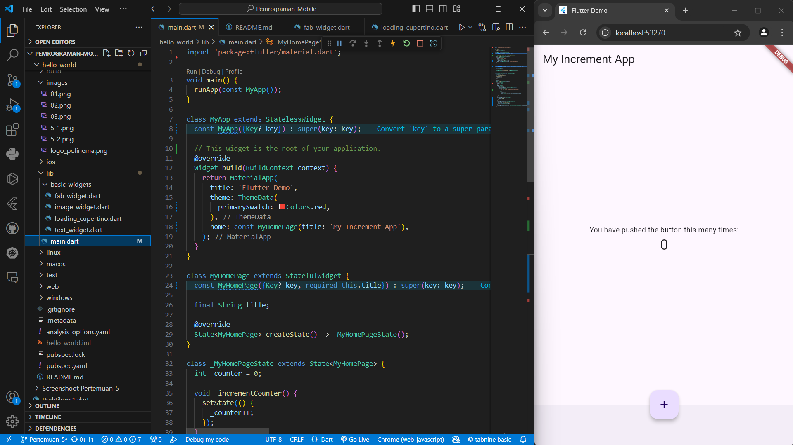

# Pemrograman-Mobile

NAMA     : Rio Bagas Hermawan

NIM      : 2241720193

# hello world

A new flutter project

# Praktikum 4 : Menerapkan Widget Dasar

Langkah 1 : Text Widget

Langkah 2: Image Widget

# Praktikum 5: Menerapkan Widget Material Design dan iOS Cupertino

Langkah 1: Cupertino Button dan Loading Bar

Langkah 2: Floating Action Button (FAB)

Langkah 3: Scaffold Widget

