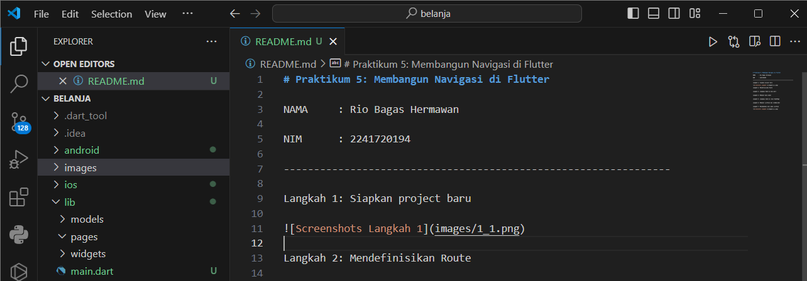

# Praktikum 5: Membangun Navigasi di Flutter

NAMA     : Rio Bagas Hermawan

NIM      : 2241720194

----------------------------------------------------------------

Langkah 1: Siapkan project baru

Langkah 2: Mendefinisikan Route

Langkah 3: Lengkapi Kode di main.dart

Langkah 4: Membuat data model

Langkah 5: Lengkapi kode di class HomePage

Langkah 6: Membuat ListView dan itemBuilder

Langkah 7: Menambahkan aksi pada ListView

