# Pemrograman-Mobile - Layout dan Navigasi

NAMA     : Rio Bagas Hermawan

NIM      : 2241720194

# Praktikum 1: Membangun Layout di Flutter

Langkah 1: Buat Project Baru

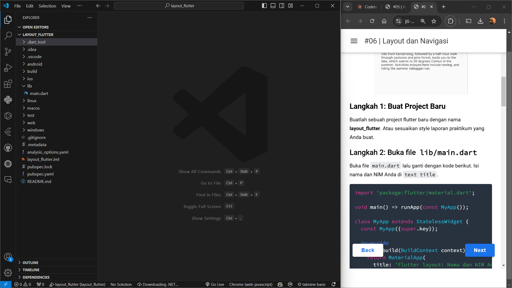

Langkah 2: Buka file lib/main.dart

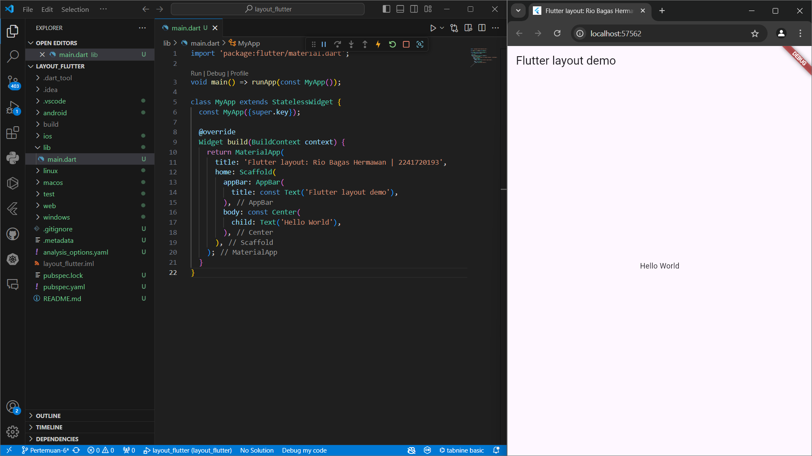

Langkah 4: Implementasi title row

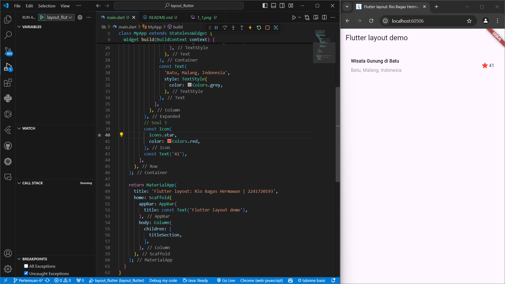

# Praktikum 2: Implementasi button row

Langkah 1: Buat method Column _buildButtonColumn

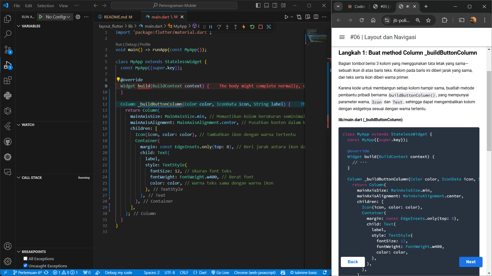

Langkah 2: Buat widget buttonSection

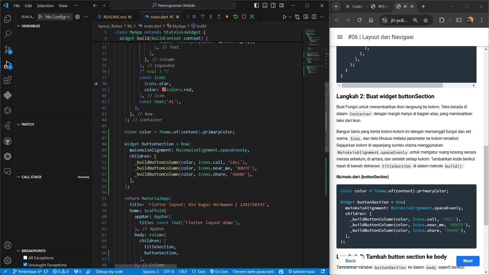

Langkah 3: Tambah button section ke body

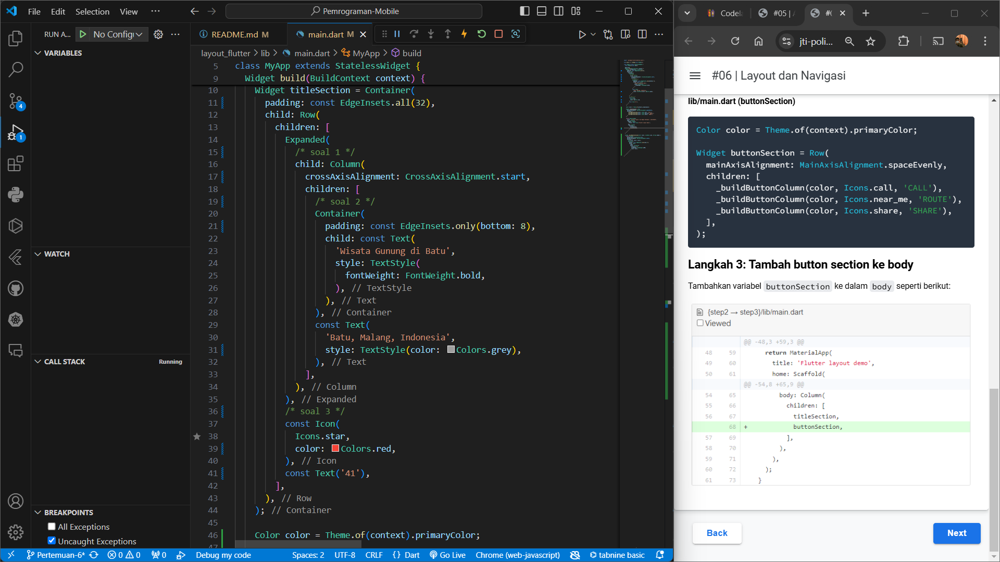

Hasil Akhir Praktikum 2

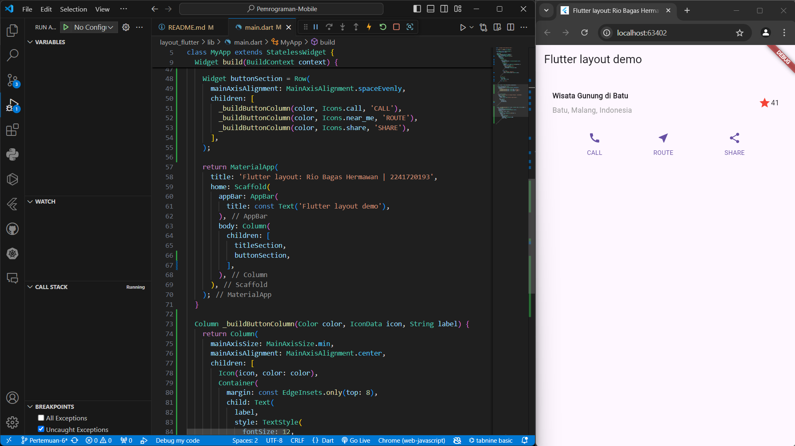

# Praktikum 3: Implementasi text section
 
Langkah 1: Buat widget textSection

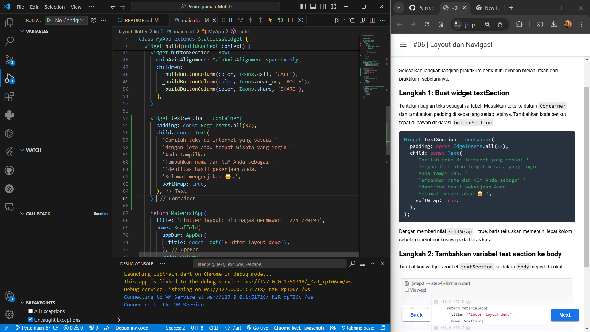

Langkah 2: Tambahkan variabel text section ke body

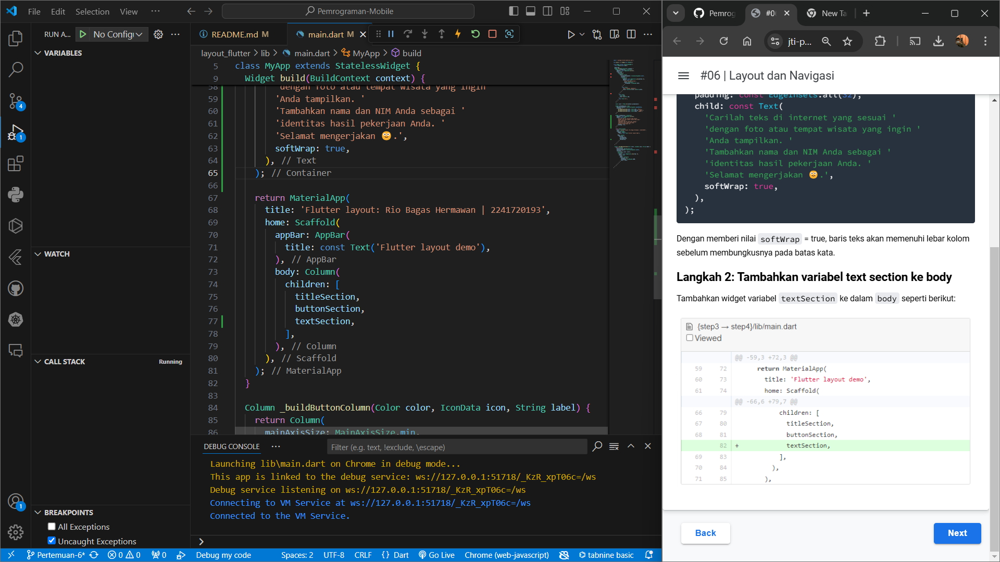

Hasil Akhir Praktikum 3

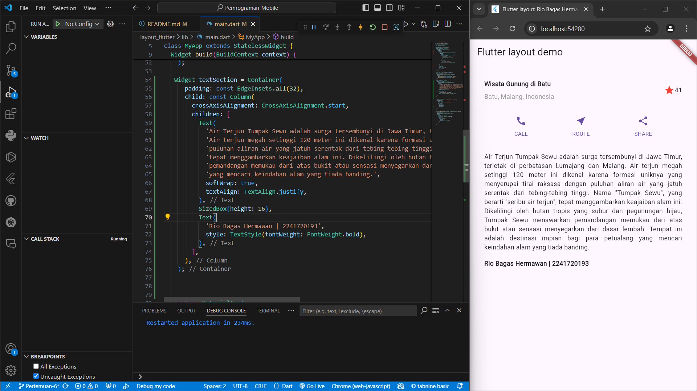

# Praktikum 4: Implementasi image section

Langkah 1: Siapkan aset gambar

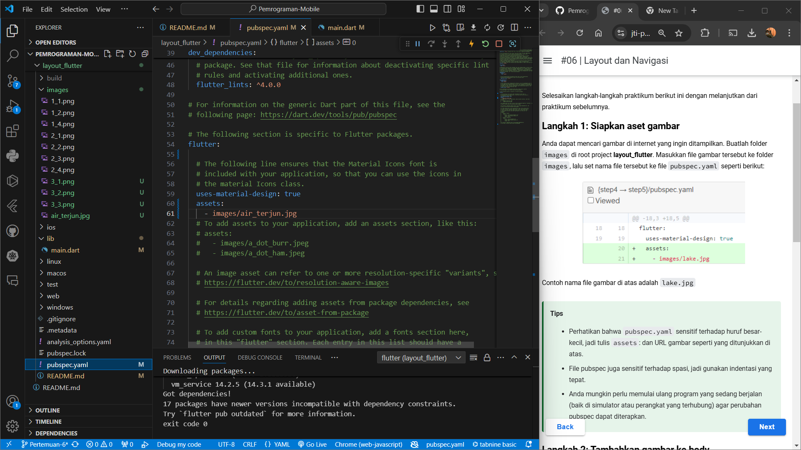

Langkah 2: Tambahkan gambar ke body

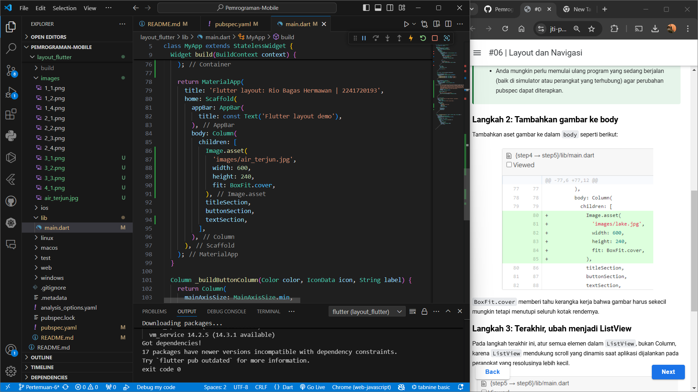

Langkah 3: Terakhir, ubah menjadi ListView

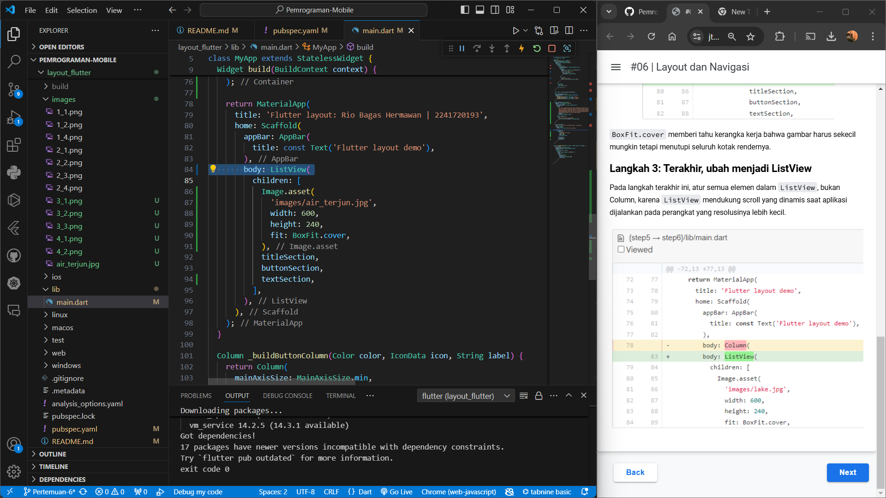

Hasil Akhir Praktikum 4

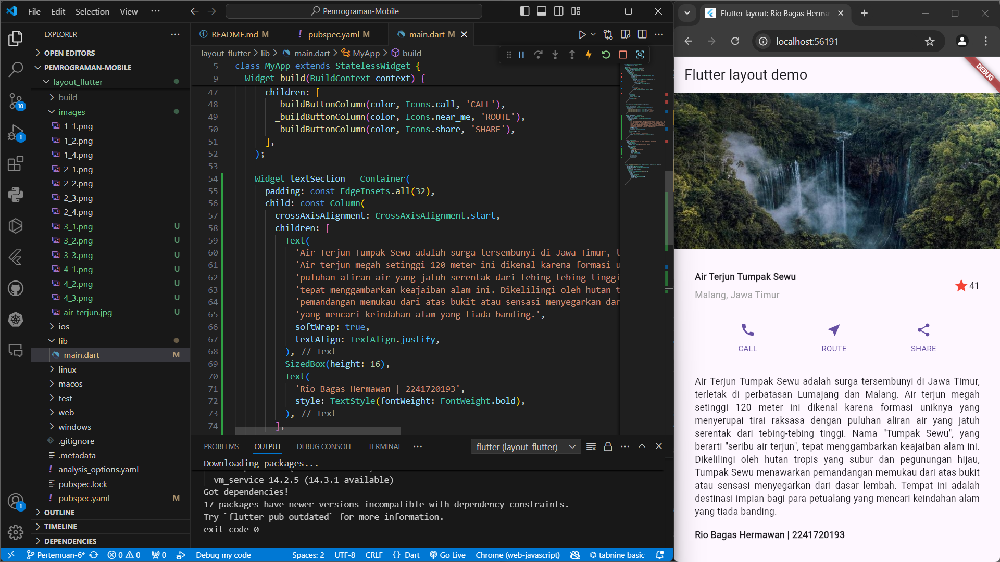
